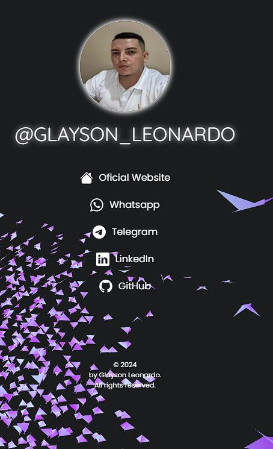

# My Bio Link | Instagram
 

<h2>Table of contents</h2>

- [Overview](#overview)
  - [The project](#the-project)
  - [Screenshot](#screenshot)
  - [Links](#links)
- [My process](#my-process)
  - [Built with](#built-with)
- [Author](#author)

<h2 id="overview"><strong>« [Overview] »</strong></h2>

<h3 id="the-project"><strong>The Project</strong></h3>

> This project is a "Link Tree" to display in the Instagram Biography.

<h3 id="screenshot"><strong>Screenshot</strong></h3>

• Layout Preview - 01  

<h3 id="links"><strong>Links</strong></h3>

- Live Site URL: [Click-me](https://glaysonl.github.io/Link.BioInstagram/)
<h2 id="my-process"><strong>« [My Process] »</strong></h2>

<h3 id="built-with"><strong>Built with</strong></h3>

- Semantic HTML5 markup
- CSS custom properties
- Mobile-first workflow
- Flexbox

<h2 id="author"><strong>« [Author] »</strong></h2>

- LinkedIn - [@Glayson1997](https://www.linkedin.com/in/glayson1997/)
- Whatsapp - [+55 (21) 9 7502-1708](https://wa.me/5521975021708)
- Instagram - [@glayson_leonardo](https://www.instagram.com/glayson_leonardo/)
- Telegram - [@GlaysonL](https://t.me/GlaysonL)
- Email - [glayson.leo@gmail.com](mailto:glayson.leo@gmail.com)